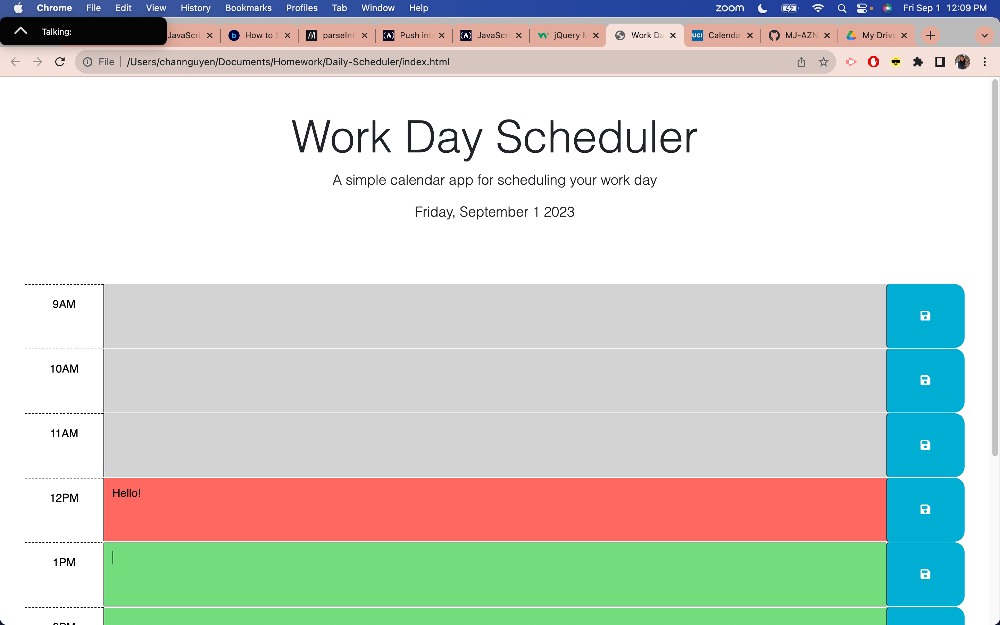
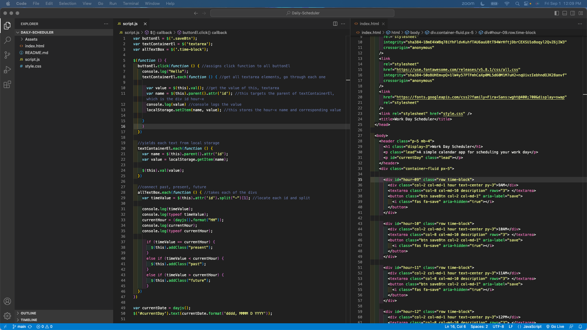

# Work Day Scheduler Starter Code
The purpose of creating a daily scheduler through the browser is to not only demonstrate my skills and knowledge on JavaScript to construct the application, but to help users plan out the tasks they need to complete for the current day, for each specific time block. This application was created with creating files for HTML, CSS, and JavaScript. The content of the page has text block areas for each time that corresponds to current hour, and a save button adjacent to the text block areas to save what was written. The deployed application can be found here: https://codeandlift706.github.io/Daily-Scheduler/.

## Installation
VS Code to create and manipulate HTML, CSS, and JavaScript for the application through the web browser. GitHub for version control and web page deployment.
Other external resources used: Dayjs library (date/time), jQuery library(for formulas), Fontawesome/Google fonts (custom text), Bootstrap (CSS).

## Visuals
View a screenshot of the application here:

View a screenshot of the VS Code here:

## Credits

The starter HTML file, JavaScript file, and CSS file are credited to the content in the starter-code repository, found here: https://github.com/coding-boot-camp/crispy-octo-meme.
The coding (variables, conditional statements, console logs, jquery specific formulas, functions) -all the additions- that were made to the web page are credited to the curriculum taught in the UCI coding boot camp and are credited to the instructor, AskBCS Learning Assistant, and classmates in the UCI coding boot camp.

The source for how to create an eventlistener in bulk: https://stackoverflow.com/questions/19543854/html5-storing-multiple-text-boxes-to-local-storage

How I found the Dayjs formula and format: https://day.js.org/docs/en/display/format

How I learned more about Jquery attributes for my code: https://www.w3schools.com/jquery/html_attr.asp#:~:text=The%20attr()%20method%20sets,the%20set%20of%20matched%20elements.
How I use the split() function can be found here: https://www.w3schools.com/jsref/jsref_split.asp.

How I aligned text can be found here: https://css-tricks.com/almanac/properties/t/text-align/#:~:text=The%20text%2Dalign%20property%20in,aligns%20along%20the%20left%20side.

To complete the README with screenshots, the source for the code is: https://stackoverflow.com/questions/10189356/how-to-add-screenshot-to-readmes-in-github-repository. To complete the README section, the source is: https://www.makeareadme.com/. 
